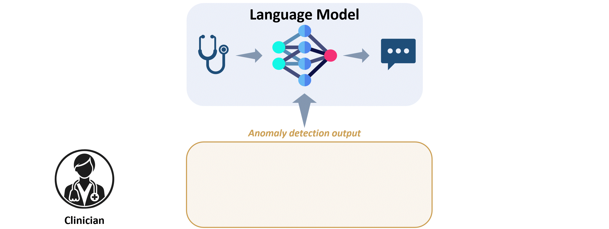

# Language Models Meet Anomaly Detection for Better Interpretability and Generalizability

This repository hosts the code for our paper titled "Language Models Meet Anomaly Detection for Better Interpretability and Generalizability".


*Our framework is designed to process questions in conjunction with results from anomaly detection methods aiming to provide clinicians with clear, interpretable responses that render anomaly map analyses more intuitive and clinically actionable.*


## Dataset Setup
- **MI-VQA Dataset**: Download from [this link](https://drive.google.com/file/d/1mHjtd_yV6ewRFC7ujwBM9_HDSnKUx5l5/view?usp=sharing) and save it to `./data/dataset`.
  - To preprocess the dataset, run:
    ```
    cd data
    python preprocess_dataset.py
    ```

## Usage Instructions
- **Model Training**
  - Train the model by navigating to the model's directory and executing the provided script:
    ```
    cd ./models/VQA
    sh run.sh
    ```
  - Training checkpoints will be saved in `./data/ckpts/`.

- **Result Generation**
  - Generate results by running the inference script:
    ```
    cd ./models/inference
    sh run_vqa_inference.sh
    ```
  - Results will be stored in `./evaluation/res/`.

- **Result Evaluation**
  - Evaluate the results using:
    ```
    cd evaluation
    python evaluate.py
    ```

- **GUI Interface**
  - For a graphical interface, use Streamlit:
    ```
    cd ./models/inference
    streamlit run streamlit_gui.py
    ```


